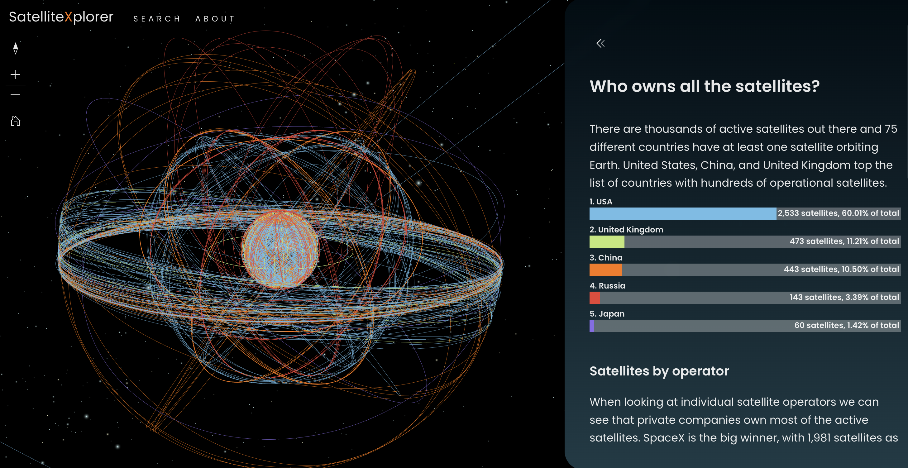
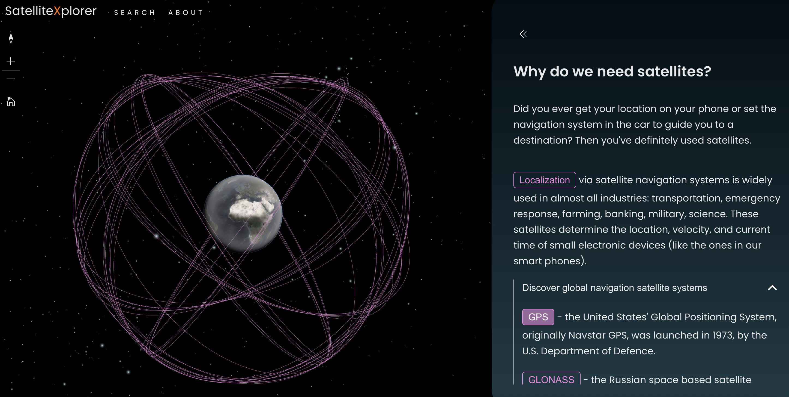

A 3D interactive visualization of satellite orbits, explaining how we use satellites, how high are they orbiting the Earth,
what are major satellite constellations and who owns them.
The data is outdated, but I kept it online more as an educational tool than a live tracker. See the interactive version here: [Satellite Explorer](https://geoxc-apps4.bd.esri.com/satellite-explorer/).

Who owns the satellites in orbit around the Earth?

Track the International Space Station in real time:

The Global Positioning System (GPS) constellation:
