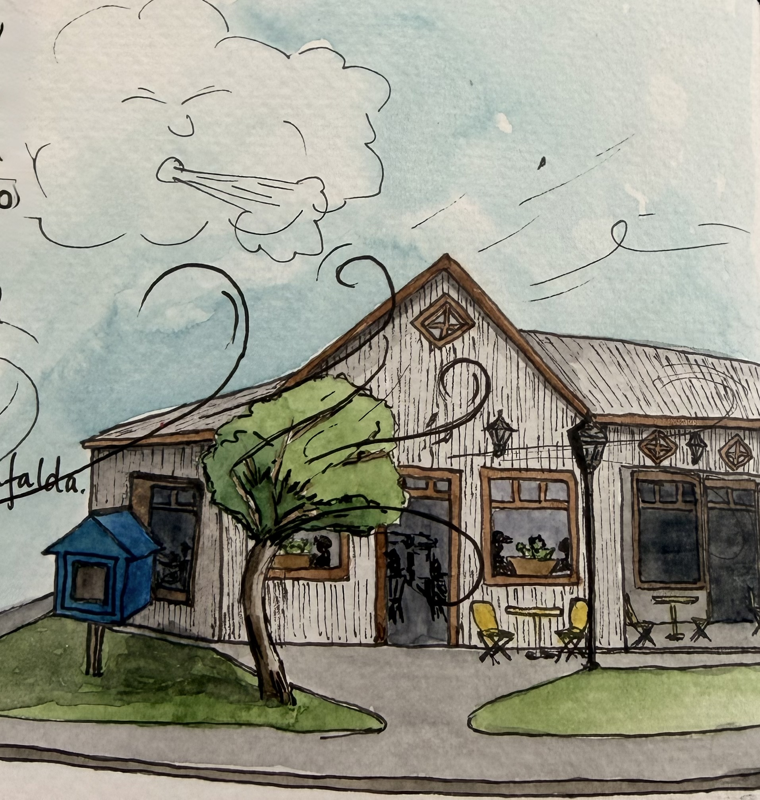
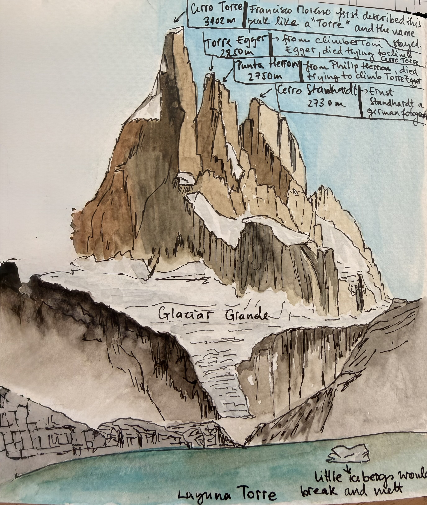
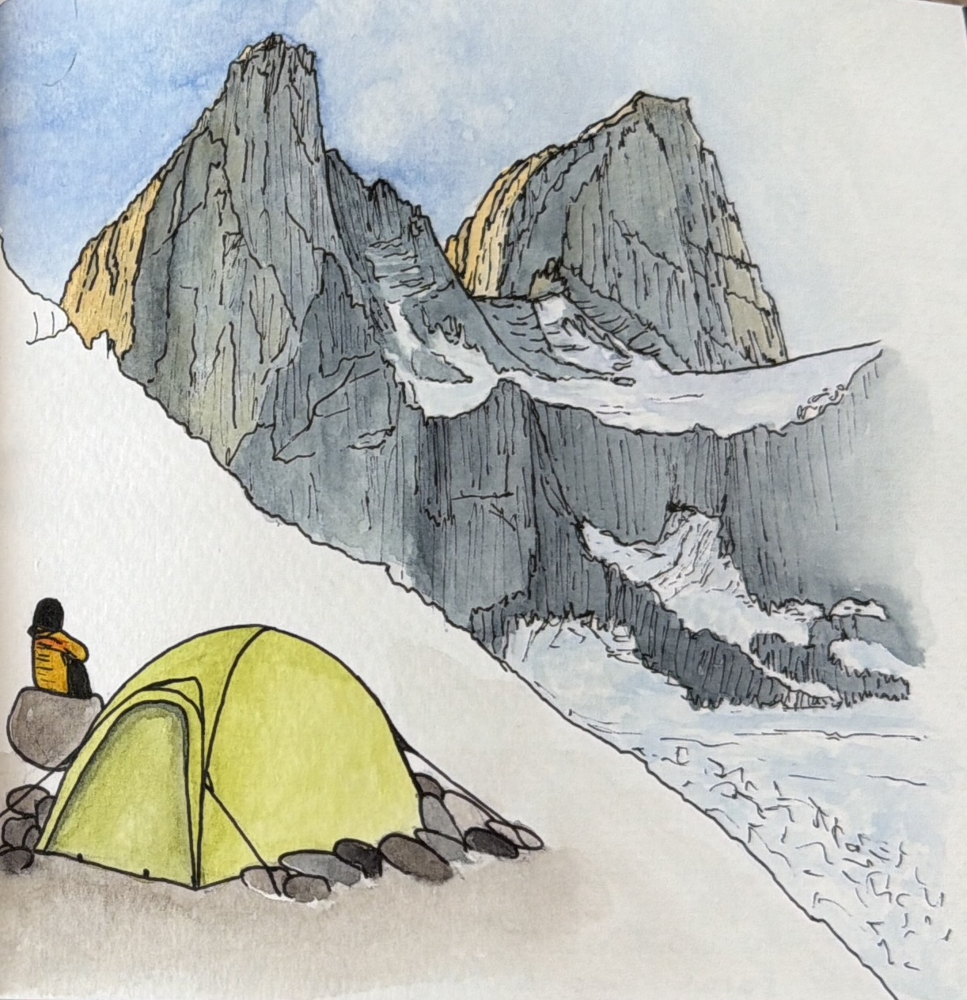
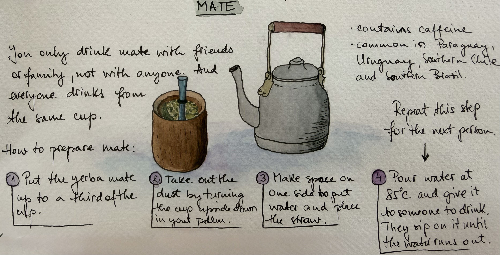

I travelled to Patagonia this year and I used a sketchbook for the first time.

My favorite cafe in El Chaltén, Patagonia, Argentina was La Esquina. They had such tasty
food and a huge book of all Mafalda comics. I spent a lot of time there when it was 
windy and rainy outside.

I hiked alone to Cerro Torre and I took some time to paint the view of the mountains.

Watercolor painting of the camping in Patagonia the night before going up the Mojon Rojo:

I love the tradition of drinking mate with friends. So I made this watercolor of
my first mate in La Esquina and I also wrote about how to prepare it.

