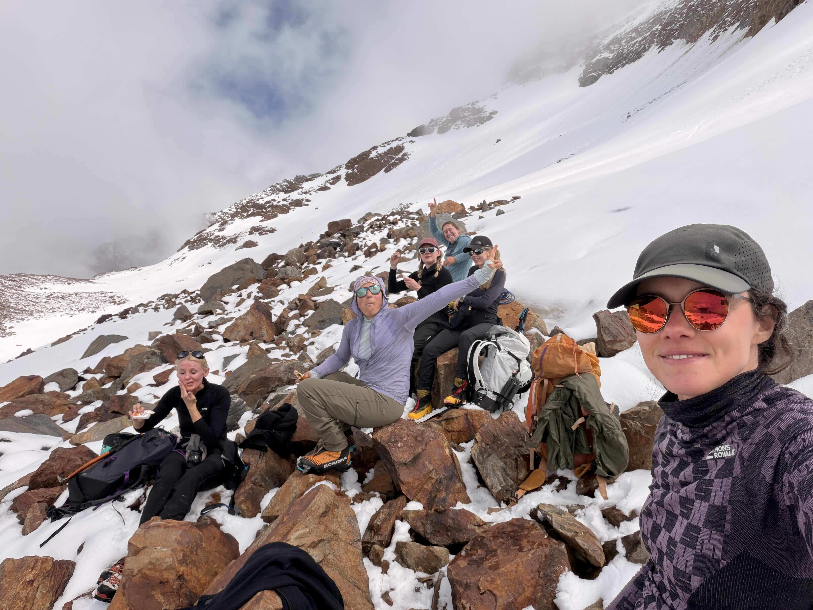
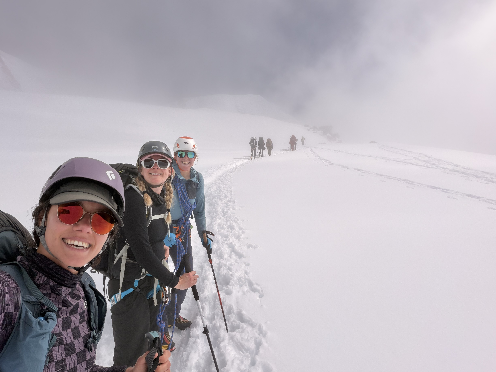
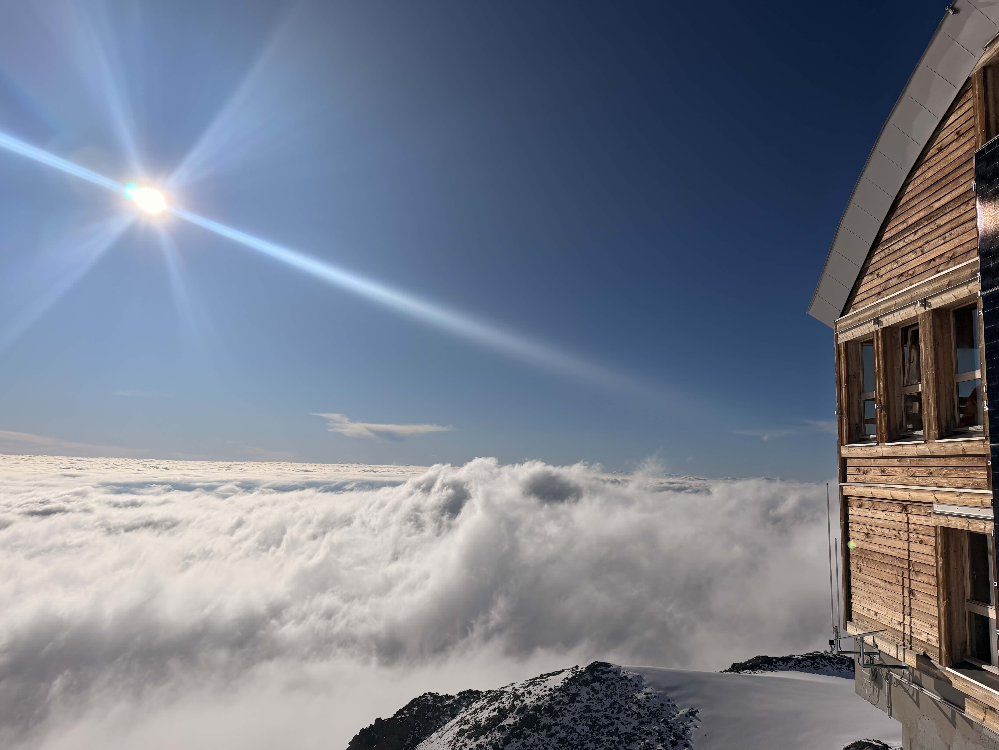
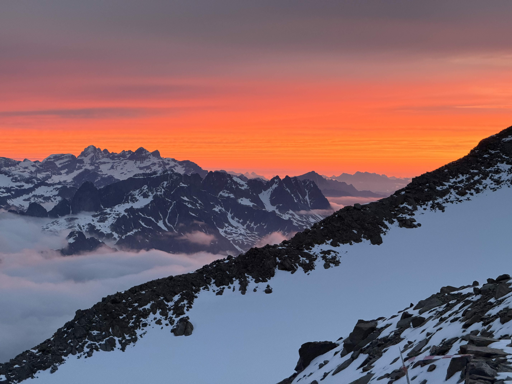
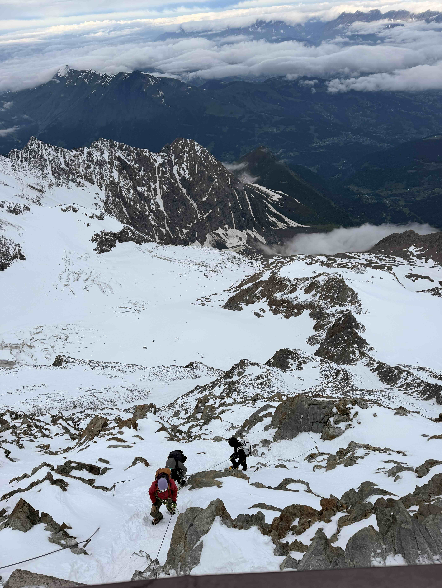
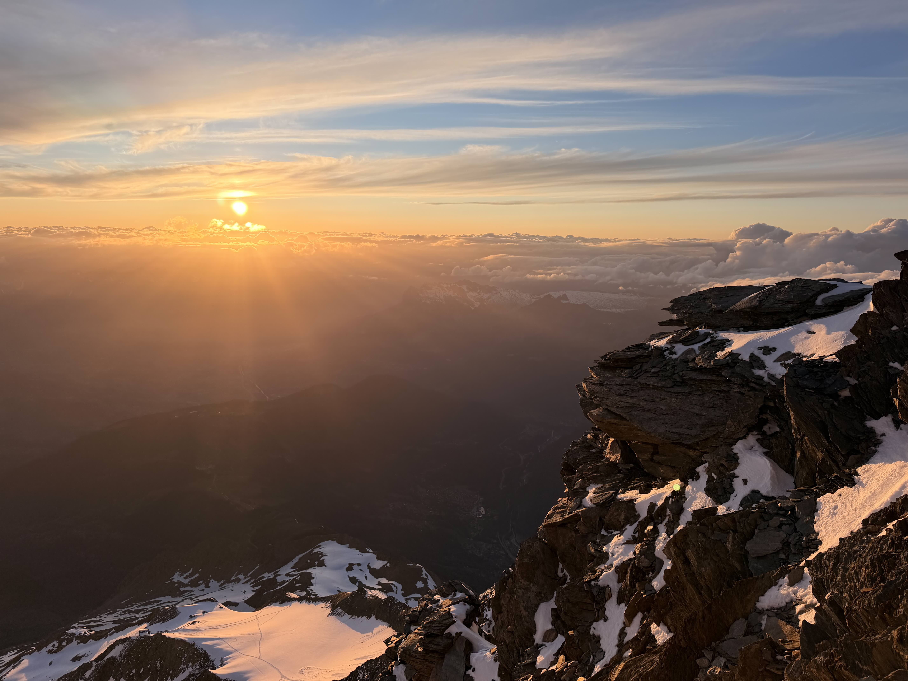

import StoryMap from '~/components/viz/StoryMap.astro';
import StorySection from '~/components/viz/StorySection.astro';
import Caption from '~/components/viz/Caption.astro';
import Gallery from '~/components/viz/Gallery.astro';

A 19 km out-and-back along the classic **Goûter route** on Mont Blanc — from the
Bellevue cable-car station up to the Aiguille du Goûter, a summit attempt, and the
way back down.

<StoryMap
  id="mont-blanc"
  trackUrl="/articles/mt-blanc-attempt/data/track.geojson"
  pointsUrl="/articles/mt-blanc-attempt/data/points.geojson"
>

<StorySection progress={0.25} center={[6.7801, 45.8738]} zoom={11}>

## Bellevue

How did you get to Mont Blanc? We took a taxi. No joke, our strip started with a taxi ride up to **Bellevue** (1,800 m).
From there we started hiking and the trail climbs steadily across the Mont Lachat ridge toward the
Nid d'Aigle and the start of the real ascent. We started in t-shirts and slowly made our way into winter.

</StorySection>

<StorySection progress={0.4} center={[6.8175, 45.8549]} zoom={11}>

## Up to Tête Rousse

A long, rising traverse leads to the **Tête Rousse refuge** (3,167 m), perched on the
glacier of the same name.

When we got to the hut, the clouds were below us and the feeling of being on top of the clouds was amazing.

Here we stayed for the night, and we woke up to the most beautiful sunrise over the mountains.
We left around 5pm which is a bit later than the usual start time, but we wanted to ditch some strong winds higher up.

</StorySection>

<StorySection progress={0.45} center={[6.8308, 45.8511]} zoom={11}>

## The Grand Couloir & Refuge du Goûter

Above Tête Rousse comes the infamous **Grand Couloir du Goûter** — a rockfall-raked
gully that we luckily had good conditions to cross and we did so quickly. Next, we climbed up a steep rocky ridge all the way up to the
**Refuge du Goûter** (3,835 m).

At the hut we waited for a while for the winds to calm down. Around 11am our guide said we can make an attempt,
but I could see that she wasn't so optimistic. The clouds were still thick and visibility was very poor. The wind
had calmed down.

</StorySection>

<StorySection progress={0.6} center={[6.8405, 45.8438]} zoom={11}>

## The attempt

From the Goûter hut the route continues onto the glacier toward the Dôme du Goûter and the
Vallot shelter. This is as far as we got — we **turned back** here at around 4200m. I felt bad about it, 
but at the same time I trusted our guide and it wasn't fun at all to hike on the glacier without seeing anything.

</StorySection>

<StorySection progress={0.6} center={[6.8176, 45.856]} zoom={11}>

## Back to the hut

So we went back to the hut and stayed there for the night. We ate **a lot** of good food and it made 
me think how french love good food and you can find it even at huts at 3,800m. 

<Caption>We had a gorgeous sunset as a compensation for the failed summit attempt.</Caption>

</StorySection>

<StorySection progress={0.7} center={[6.8176, 45.856]} zoom={11}>

## The descent

The next day we woke up around 5 and went for breakfast straight to the Tête Rousse refuge. 
We also crossed the Couloir one more time without any issues.

</StorySection>

<StorySection progress={1} center={[6.7801, 45.8738]} zoom={11}>

## Back to Bellevue

We took a different way back to Bellevue, through the snow with crampons.

</StorySection>

</StoryMap>

*Placeholder narrative — replace with your own story, and add photos with the
`Gallery` / `Caption` components.*
