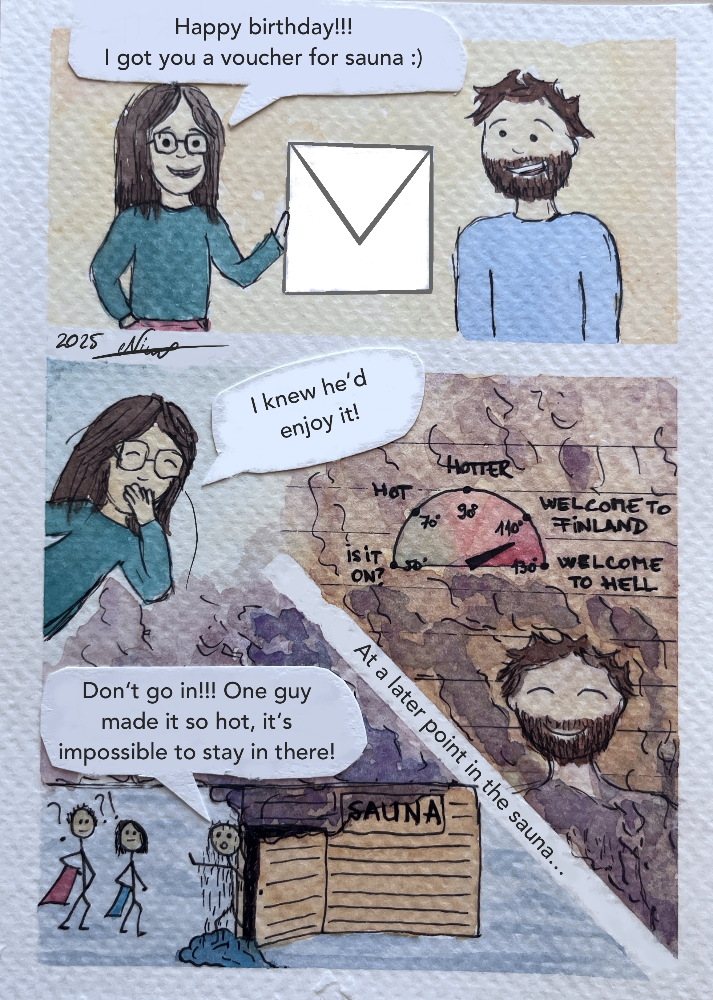

This is my attempt at capturing those funny daily moments that we forget about at the end of the day.

For example, this one happened at work. Me, the janitor and a guy from Apple walk into an elevator. The janitor started asking 
the Apple guy existential questions. The rest is laughs and uncomfortable silences 😁

I like flamenco, but after this concert I realized that I like more the dancing than the music. The singer was shouting like crazy and there was no dancing in this show... so I 
don't think my friend will like to experience another flamenco show again.

This one is to that one friend for whom the sauna is never hot enough.
