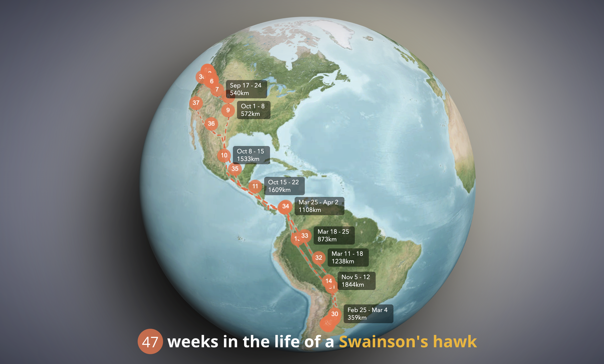

Last year I supervised a master thesis about bird migration. I got aquainted with the [Movebank platform](https://www.movebank.org/), 
a free online database of animal tracking data and I found the GPS path of the Swainson's Hawk, 
a bird that migrates from North America to South America. 
You can check out the interactive version on [labs.esri.com/bird-migration](https://labs.esri.com/bird-migration/) and the code on [GitHub](https://github.com/RalucaNicola/bird-migration).

